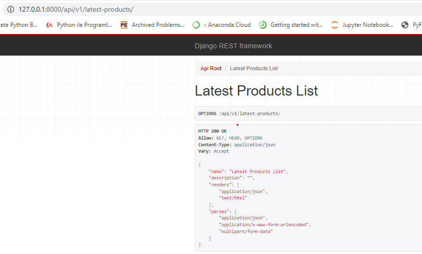

Anlaşılmayan bir yer olursa diye bu linkten bakılabilir https://www.youtube.com/watch?v=Yg5zkd9nm6w&list=PL9B8lSoNJPThNbrFq
https://github.com/SteinOveHelset/djackets_vue
https://github.com/SteinOveHelset/djackets_django

t6-xPK1ZdbpgJ6ln&index=87&t=1697s
# djangoAndVue

# Install and setup (Django)

python3 -m venv enviroment_3_8_2

> .\[Virtual Environment Folder Name]\Scripts\activate
Example,
> .\sample_venv\Scripts\activate
>
> pip install virtualenv
>
> pip install django
> pip install django-rest-framework
> pip install django-cors-headers
> pip install djoser
> pip install pillow
> pip install stripe
>
> django-admin startproject djackets_django --> projeyi oluşturdu
>
> settings içerisindeki INSTALLED_APPS içerisine :
> 'rest_framework', 'rest_framework.authtoken', 'corsheaders', 'djoser' bunları ekledik 
> daha sonra INSTALLED_APPS altına CORS_ALLOWED_ORIGINS = ["http://localhost:8080",] ekledik
>
> Daha sonra MIDDLEWARE içerisine 'corsheaders.middleware.CorsMiddleware', bunu ekledik

> bunun ardından urls içerisine aşağıda bulunan kod bloğunu ekledik

> from django.contrib import admin
>from django.urls import path, include
>urlpatterns = [
>    path('admin/', admin.site.urls),
>    path('api/v1/',include('djoser.urls')),
>    path('api/v1/',include('djoser.urls.authtoken')),
>]

> python manage.py makemigrations migration yapmak için bunu yazdık
> python manage.py migrate ardından bunu yazdık

> python .\manage.py createsuperuser admin kulanıcısı oluşturduk

> python .\manage.py runserver ayağa kaldırdık


# VUE için Yükleme Yöntemi

> vue create djackets_vue
> ? Please pick a preset: Manually select features
> ? Check the features needed for your project: Babel, Router, Vuex, CSS Pre-processors
> ? Choose a version of Vue.js that you want to start the project with 3.x
> ? Use history mode for router? (Requires proper server setup for index fallback in production) Yes
> ? Pick a CSS pre-processor (PostCSS, Autoprefixer and CSS Modules are supported by default): Sass/SCSS (with dart-sass)
> ? Where do you prefer placing config for Babel, ESLint, etc.? In dedicated config files
> ? Save this as a preset for future projects? No

> npm install axios
> npm install bulma

# Include font awsome index.html içerisine cdn ekleyeceğiz.
> <link rel="stylesheet" href="https://cdnjs.cloudflare.com/ajax/libs/font-awesome/5.15.2/css/all.min.css">

# Setup the base template
> App.vue dosyası içerisinde navbar template'ini oluşturuduk html ile ve bulma frameworkünün css'ini import edip html classlarında kullandık 
> daha sonra homeview içerisindeki componentlerde kullanılan hello worldu sildik


Daha sonra Django üzerinde app oluşturduk ve model ayarlama işlemi
> python manage.py startapp product 
> oluşturduğumuz appi INSTALLED_APPS içerisine atacağız
> python .\manage.py makemigrations
> python .\manage.py migrate
> settings içerisine MEDIA_URL = '/media/' ekledik
> settings içerisine MEDIA_ROOT = BASE_DIR / 'media/' ekledik 
> daha sonra urls.py içerisine from django.conf import settings ekledik
> daha sonra urls.py içerisine from django.conf.urls.static import static


Create a serializer and views for the products --> databaseden alıp json'a döndüren yer
> yeni seralizers diye bir dosya oluşturduk daha sonra bunun içerisinde frontendde kullanacağımız parametreleri söyledik
>  from rest_framework import serializers
> from .models import Category, Product
> bu import işlemlerini yaptık
> 
> daha sonra views içerisine girdik
> buraya 
> from .serializers import ProductSerializers
> from .models import Product
> from rest_framework.views import APIView
> from rest_framework.response import Response
> ekleme işlemini yaptık 
> daha sonra bunlarla ilgili serialize yapan class'ı ekledik 
>
> Bunların ardından product içerisinde bir urls.py dosyası açtık
> buraya 
> from django.urls import path, include
> from product import views
> bu importları yaptık
> daha sonra 
> urlpatterns = [
>    path('latest-products/', views.LatestProductsList.as_view())
> ]
> ekledik ve ana proje içerisindeki urls.py dosyası içerisine bu urls'i import ettik
> 
> ve urlpattern listesi içerisine path('api/v1/',include('product.urls')) bu uzantıyı ekledik
> bunların sayesinde 

> bunların ardından admin.py dosyasına giderek modelleri import edip admin ile register ettik

> from .models import Category, Product
> admin.site.register(Category)
> admin.site.register(Product)
> bunları yaptıktan sonra veri tabanına gidip istediğimiz verileri alabildik
>

Daha sonra Home.vue içerisinde değişiklikler yaptık script içerisine şunları ekledik

```Javascript
<script>
import axios from "axios";

export default {
  name: 'HomeView',
  data(){
    return{
      latestProducts: []
    }
  },
  components: {
    
  },
  mounted(){
    this.getLatestProducts()
  },
  methods: {
    getLatestProducts(){
      axios.get("/api/v1/latest-products/")
      .then(response => {
        this.latestProducts.push(response.data)
      })
      .catch(err => {
        console.log('err :>> ', err);
      })
    }
  }
}
</script>

<style scoped>
  .image{
    margin-top: -1.25rem;
    margin-left: -1.25rem;
    margin-right: -1.25rem;
  }
</style>
```

Daha sonra main.js dosyası içerisine kodlarını ekledik ki djangoda çalışan url'e gitisn diye
>import axios from "axios"
>axios.defaults.baseURL = 'http://127.0.0.1:8000'
>createApp(App).use(store).use(router, axios).mount('#app')

View a product
> burada views içerisine productdetail getirmek için bir kod yazdık
```Python
class ProductDetail(APIView):
    
    def get_object(self, category_slug, product_slug):
        try:
            return Product.objects.filter(category__slug=category_slug).get(slug=product_slug)
        except Product.DoesNotExist:
            raise Http404
    
    def get(self, request, category_slug, product_slug, format=None):
        product = self.get_object(category_slug, product_slug)
        serializer = ProductSerializers(product)
        return Response(serializer.data)

```
> bu kodu yazdık daha sonra urls içerisine 
> path('products/<slug:category_slug>/<slug:product_slug>/', views.ProductDetail.as_view()),


> Şimdide Product.vue adında bir dosya oluşturduk
> içerisine yapmak istediğimiz şeyleri yaptık ve görüntüsünü oluşturduk 
> daha sonra router içerisindeki index.js içerisine
```Javascript
{
    path: '/:category_slug/:product_slug/',
    name: 'Product',
    component: Product

}
```
> kodunu ekledik. ardından Product.vue içerisinde product'a dönen değerleri ekleyen bir yapı kurduk

Daha sonra store dosyası içerisindeki index.js içerisine 

```javascript
export default createStore({
  state: {
    cart: {
      items:[]
    },
    isAuthenticated: false,
    token: '',
    isLoading: false
  },
  getters: {
  },
  mutations: {
  },
  actions: {
  },
  modules: {
  }
})
```
> kodunu ekledik burada amacımız cart' ulaşmak için otentike mi değil mi diye kontrol işlemini yapabilmek

Daha sonra yine store dosyası içerisindeki index.js içerisine 
```Javascript
import { createStore } from 'vuex'

export default createStore({
  state: {
    cart: {
      items:[]
    },
    isAuthenticated: false,
    token: '',
    isLoading: false
  },
  getters: {
  },
  mutations: {
    initializeStore(state){
      if(localStorage.getItem('cart')){
        state.cart = JSON.parse(localStorage.getItem('cart'))
      }
      else{
        localStorage.setItem('cart',JSON.stringify(state.cart))
      }
    },
    addToCart(state, item){
      const exists = state.cart.items.filter(i=> i.product.id === item.product.id)
      if(exists.length){
        exists[0].quantity = parseInt(exists[0].quantity + parseInt(item.quantity))
      }
      else{
        state.cart.items.push(item)
      }
      localStorage.setItem('cart',JSON.stringify(state.cart))
    }
  },
  actions: {
  },
  modules: {
  }
})
``` 
> kodunu ekledik mutation ile işlem yaptık

Initiliaze Store in App.vue
> daha sonra App.vue içerisine tanımladığımız storeları çağırmamız gerektiği için gidip
```Javascript
beforeCreate(){
    this.$store.commit('initializeStore')
  }
```
> bu kodu ekledik
>
Daha sonra carta eklenmiş ürünlerin saysını görebilmek için şunşarı yaptık

```Javascript
<span>Cart ({{ cartTotalLength }})</span> template içerisine bunu ekledik ve computed içersinde scriptte sayım yaptık
computed:{
    cartTotalLength(){
      let totalLength = 0
      
      for (let i = 0; i < this.cart.items.length; i++) {
        totalLength += this.cart.items[i].quantity
      }
      return totalLength;
    }
  }
```

Bunların ardından store içerisinde bulunan addToCart mutationunu kullanmak için this.$store.commit('addToCart',item) şeklinde carta ekleme işlemini yapabilen bir kısmı Product.vue içerisine yazdık
```Javascript
addToCart(){
      if(isNaN(this.quantity) || this.quantity < 1){
        this.quantity = 1
      }
      const item = {
        product: this.product,
        quantity: this.quantity
      }
      this.$store.commit('addToCart',item);
    }

bunun ardından App.vue içerisine mounted olduğunda gelmesi için şu kodu ekledik
mounted(){
    this.cart = this.$store.state.cart;
  },
  kodunu ekledik
```
Daha sonra alttaki kütüphaneyi yükledik
> npm install bulma-toast 

daha sonra Product.vue içerisine şunları ekledik

```Javascript
import { toast } from 'bulma-toast';
addToCart methodu içerisine 
toast({
        message: 'The product was added to the cart',
        type: 'is-success',
        dismissible: true,
        pauseOnHover: true,
        duration: 2000,
        position: 'bottom-right'
      
      })
bu şekilde bir ekleme yaptık
```
> yukarıdaki toast sayesinde bir işlem başarılıysa sağda küçük bir başarıyla eklendi pop-up'ı çıkartıyor


Implemeting a Loading Bar loading bar ekliyoruz buraya 
> bunu yapmak için Product.vue getProduct methodunun içerisine başına ve sonuna
```Javascript
this.$store.commit('setIsLoading', true)
...
this.$store.commit('setIsLoading', false)
```
kodlarını ekledik
> ayrıca methodu asycn yapıp axios ile attıoğımı isteği await hale getirdik bunu dışında bunu kullanmaak istediğimiz yerlere ekledik 
> store dosyası içerisindeki index.js dosyasına 
```Javascript
setIsLoading(state, status) {
      state.isLoading = status
    },
```

kodunu ekleyerek yönetimini sağladık

Set document title
> document.title = this.product.name + ' | Djackets' bunun sayesinde sekmede adının ne olarak görüneceğini vermiş oluyorum bunu da Product.vue içerisinde yaptık
> ayrıca document.title = ' Home | Djackets' bunu da mounted içerisine HomeView.vue dosyasına ekledik ki sekmede nerede olduğumuz belli olsun

Category sayfasını göstermek için şimdi product içerisindeki views'a gideceğiz
> view içerisine daha önceden yaptığımız gibi 
```Python
class CategoryDetail(APIView):
    def get_object(self, category_slug):
        try:
            return Category.objects.get(slug=category_slug)
        except Product.DoesNotExist:
            raise Http404
    def get(self, request, category_slug, format=None):
        product = self.get_object(category_slug)
        serializer = CategorySerializer(product)
        return Response(serializer.data)
```
> kodunu ekledik 

Daha sonra CategorySerializer için serializer oluşturmamış gerekiyordu ve bunu oluşturduk

```Python
class CategorySerializer(serializers.ModelSerializer):
    products = ProductSerializers(many=True)
    class Meta:
        model = Category
        fields = (
            "id",
            "name",
            "products",
            "get_absolute_url"
        )
```
> Bunun ardından urls.py içerisine gidip path('products/<slug:category_slug>/', views.CategoryDetail.as_view()), kodunu ekledik


Şimdi bunları gösterebilmek için Category.vue adında bir dosya oluşturuyoruz
> bunun içerisine göstermek istediğimiz html formatını yazdık daha sonra kategori için ayrı bir yer oluşturduk ve aşağıdaki gibi çağırdık
```Javascript
<script>
import axios from 'axios'
import {toast} from 'bulma-toast'
export default {
    name: 'Category',
    data(){
        return{
            category:{
                products: []
            }
        }
    },
    mounted(){
        this.getCategory()
    }
    methods: {
        async getCategory(){

            const categorySlug = this.$route.params.category_slug
            
            this.$store.commit('setIsLoading',true)

            await axios.get(`/api/v1/products/${categorySlug}`)
                .then(response => {
                    this.category = response.data

                    document.title = this.category.name + '| Djackets'
                })
                .catch(err => {
                    console.log('err :>> ', err);
                    toast({
                        message: 'Something went wrong. Please try again.',
                        type: 'is-danger',
                        dismissible: true,
                        pauseOnHover: true,
                        duration: 2000,
                        position: 'bottom-right'
                    
                    })
                })

            this.$store.commit('setIsLoading',false)

        }
    }
}
</script>
```

Bunların ardından bunu router dosyası içerisinde bulunan index.js dosyasının içerisinde bir tanım yapmamız gerekiyordu onu da aşağıdaki yaptık

```Javascript
import Category from '../views/Category.vue';

{
    path: '/:category_slug',
    name: 'Category',
    component: Category
  }
```
routes listesi içerisine yukarıdaki gibi ekledik 

Daha sonra kategorilerdeki ürünleri gösteren bir yer ayarladık ve fazlaca kullanılan bir yeri direkt olarak component olarak atadık onun adı da ProductBox.vue dosyası
ve categoriler arası geçiş yapabilmek adına gidip Category.vue dosyasına watch ekledik
```Javascript
watch:{
        $route(to, from){
            if(to.name === 'Category'){
                this.getCategory()
            }
        }
    },
```

Add Search Functioniality search yapmak için ihtiyacımız olan şey
views içerisine gittik ve view içerisine şunları ekledik

```Python
@api_view(['POST'])
def search(request):
    query = request.data.get('query', '')
    
    if query:
        products = Product.objects.filter(Q(name__icontains=query) | Q(description__icontains=query))
        serializer = ProductSerializers(products,many=True)
        return Response(serializer.data)
    else:
        return Response({'products':[]})
```
ardından urls içerisine gidip 
path('products/search/',views.search), pathini ekledik

Daha sonra arama yapabilmek için frontend'e ekleme işlemlerini yaptık App.vue içersine

```HTML
<div class="navbar-start">
          <div class="navbar-item">
            <form method="get" action="/search">
              <div class="field has-addons">
                <div class="control">
                  <input type="text" class="input" placeholder="What are you looking for?" name="query">
                </div>
                <div class="control">
                  <button class="button is-success"><span class="icon"><i class="fas fa-search"></i></span></button>
                </div>
              </div>
            </form>
          </div>
        </div>
```

bu şekilde ekledik 
daha sonra Search.vue adında bir dosya oluşturduk yapmak istediklerimizi yaptık ekledik ve ardından router içerisindeki index.js'ye yolunu ekledik

```Javascript
import Search from '../views/Search.vue';
{
    path: '/search',
    name: 'Search',
    component: Search
  }
```  

View Cart

Cart.vue adında bir view oluşturduk.

SignUp.vue dosyasının oluşturulması oluşturuldu

Login sayfası oluşturma işlemi yapma bunu da yaptık ardından  my account page oluşturuyoruz

şimdu burada router dosyasi içerisindeki index.js dosyasının içerisine 

```javascript
{
    path: '/my-account',
    name: 'MyAccount',
    component: MyAccount,
    meta:{
      requireLogin: true
    }
router.beforeEach((to, from, next) => {
  if (to.matched.some(record => record.meta.requireLogin) && !store.state.isAuthenticated) {
    next({ name: 'LogIn', query: { to: to.path } });
  } else {
    next()
  }
})
```
bu kodu ekledik ki giriş yapılmadan myaccount kısmına erişelemesin

daha sonra checkout işlemini yaptık

şimdi settings.py dosyasına gidip

STRIPE_SECRET_KEY = 'sk_test_51HIHiuKBJV2qeWbD4IBpAODack7r7r9LJ0Y65zSFx7jUUwgy2nfKEgQGvorv1p2xp7tgMsJ5N9EW7K1lBdPnFnyK00kdrS27cj' 

bu kodu içerisine ekliyoruz

şimdi django üzerinde yeni bir app'e ihtiyacımız var 

python .\manage.py startapp order yazarak yeni bir app oluşturduk

settigns'e gidip INSTALLED_APPS içerisine order'ı ekledik bunu ekledik

daha sonra models.py dosyasını 
```Python
from django.contrib.auth.models import User
from django.db import models

from product.models import Product

class Order(models.Model):
    user = models.ForeignKey(User, related_name='orders', on_delete=models.CASCADE)
    first_name = models.CharField(max_length=100)
    last_name = models.CharField(max_length=100)
    email = models.CharField(max_length=100)
    address = models.CharField(max_length=100)
    zipcode = models.CharField(max_length=100)
    place = models.CharField(max_length=100)
    phone = models.CharField(max_length=100)
    created_at = models.DateTimeField(auto_now_add=True)
    paid_amount = models.DecimalField(max_digits=8, decimal_places=2, blank=True, null=True)
    stripe_token = models.CharField(max_length=100)

    class Meta:
        ordering = ['-created_at',]
    
    def __str__(self):
        return self.first_name

class OrderItem(models.Model):
    order = models.ForeignKey(Order, related_name='items', on_delete=models.CASCADE)
    product = models.ForeignKey(Product, related_name='items', on_delete=models.CASCADE)
    price = models.DecimalField(max_digits=8, decimal_places=2)
    quantity = models.IntegerField(default=1)

    def __str__(self):
        return '%s' % self.id
```
bu şekilde doldurduk

bunları yaptıkdan sonra migration yapmamız lazım bu yüzden 
python .\manage.py makemigrations 
python .\manage.py migrate   
diyerek migrate ettik

şimdi views içerisine giriyoruz view içerisine 
```Python
import stripe

from django.conf import settings
from django.contrib.auth.models import User
from django.http import Http404
from django.shortcuts import render

from rest_framework import status, authentication, permissions
from rest_framework.decorators import api_view, authentication_classes, permission_classes
from rest_framework.views import APIView
from rest_framework.response import Response

from .models import Order, OrderItem
from .serializers import OrderSerializer, MyOrderSerializer

@api_view(['POST'])
@authentication_classes([authentication.TokenAuthentication])
@permission_classes([permissions.IsAuthenticated])
def checkout(request):
    serializer = OrderSerializer(data=request.data)

    if serializer.is_valid():
        stripe.api_key = settings.STRIPE_SECRET_KEY
        paid_amount = sum(item.get('quantity') * item.get('product').price for item in serializer.validated_data['items'])

        try:
            charge = stripe.Charge.create(
                amount=int(paid_amount * 100),
                currency='USD',
                description='Charge from Djackets',
                source=serializer.validated_data['stripe_token']
            )

            serializer.save(user=request.user, paid_amount=paid_amount)

            return Response(serializer.data, status=status.HTTP_201_CREATED)
        except Exception:
            return Response(serializer.errors, status=status.HTTP_400_BAD_REQUEST)
    
    return Response(serializer.errors, status=status.HTTP_400_BAD_REQUEST)

class OrdersList(APIView):
    authentication_classes = [authentication.TokenAuthentication]
    permission_classes = [permissions.IsAuthenticated]

    def get(self, request, format=None):
        orders = Order.objects.filter(user=request.user)
        serializer = MyOrderSerializer(orders, many=True)
        return Response(serializer.data)
```

bunları ekledik

bunları yaparken aynı zamanda serializers'da ekledik

```Python
from rest_framework import serializers

from .models import Order, OrderItem

from product.serializers import ProductSerializer

class MyOrderItemSerializer(serializers.ModelSerializer):    
    product = ProductSerializer()

    class Meta:
        model = OrderItem
        fields = (
            "price",
            "product",
            "quantity",
        )

class MyOrderSerializer(serializers.ModelSerializer):
    items = MyOrderItemSerializer(many=True)

    class Meta:
        model = Order
        fields = (
            "id",
            "first_name",
            "last_name",
            "email",
            "address",
            "zipcode",
            "place",
            "phone",
            "stripe_token",
            "items",
            "paid_amount"
        )

class OrderItemSerializer(serializers.ModelSerializer):    
    class Meta:
        model = OrderItem
        fields = (
            "price",
            "product",
            "quantity",
        )

class OrderSerializer(serializers.ModelSerializer):
    items = OrderItemSerializer(many=True)

    class Meta:
        model = Order
        fields = (
            "id",
            "first_name",
            "last_name",
            "email",
            "address",
            "zipcode",
            "place",
            "phone",
            "stripe_token",
            "items",
        )
    
    def create(self, validated_data):
        items_data = validated_data.pop('items')
        order = Order.objects.create(**validated_data)

        for item_data in items_data:
            OrderItem.objects.create(order=order, **item_data)
            
        return order
```

bunları yaptıktan sonra urlleri ekledik urls.py içerisine 
```Python
from django.urls import path

from order import views

urlpatterns = [
    path('checkout/', views.checkout),
    path('orders/', views.OrdersList.as_view()),  
]
```

ardından ana proje içerisindeki url içerisine path('api/v1/', include('order.urls')), bu url'i ekledik


daha sonra admin.py içerisine giderek modellerimizi kaydettik.

```Python
from django.contrib import admin

from .models import Order, OrderItem

admin.site.register(Order)
```


Eğer ki bir delopy işlemi olursa videoya bakıp yapabilirsin